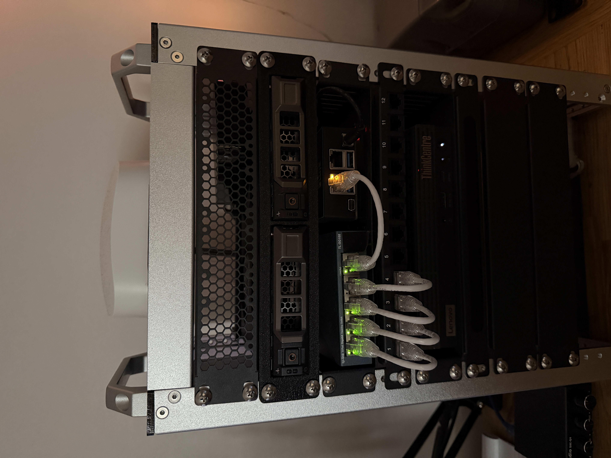
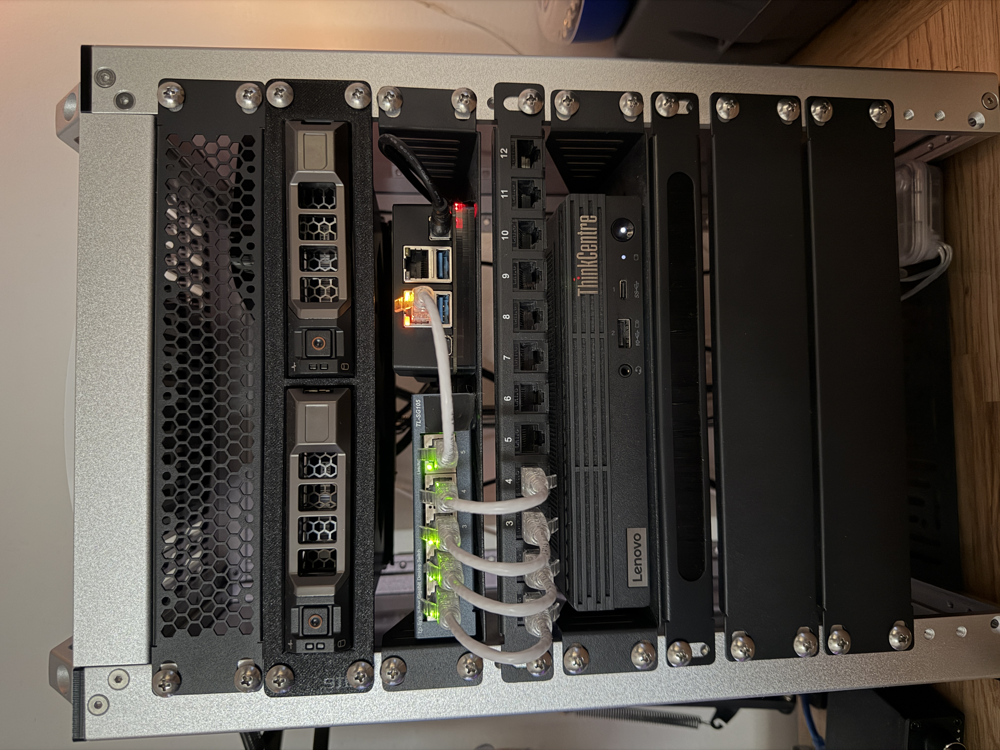

Welcome to my HomeLab. This environment is designed for learning, self-hosting, and exploring virtualization, containers, networking, and storage.
Below is an overview of the hardware and services powering the lab.

---

## Server: Lenovo ThinkCentre M90q

**Specs**

- Intel Core i5-10600 @ 3.30 GHz
- 32 GB DDR4 RAM (upgraded from 16 GB)
- Storage: 1 TB SSD + 256 GB SSD
- ASRock A380 Challenger ITX 6GB OC GPU (passed through for transcoding)

**Operating System:** Proxmox VE Hypervisor

**Nodes**

- **Media Container (Ubuntu):**

  - Mounted ZFS storage
  - Acts as separate data layer for media stack

- **Media Server VM (Ubuntu Server):**

  - Jellyfin with GPU passthrough for hardware transcoding
  - Data mounted from media container
  - Tailscale for remote access

  **Portainer VM (Ubuntu Server):**

  - Minecraft Server (itzg/minecraft-server:latest)
  - miscellaneous Docker Containers

## NAS: ZimaBoard 832

**Specs:**

- Intel Celeron N3450 @ 1.1 GHz
- 8 GB RAM
- 32 GB eMMC
- Drives:
  - 2× 4 TB WD Blue HDDs (mirrored ZFS pool)
  - 256 GB SSD (Pi-hole + future apps)

**Operating System:** TrueNas

**Uses:**

- NFS shares to Proxmox
- Windows (SMB) Shares

## Server Rack

- GeeekPi T1 10" 8U Server Cabinet
- 2 Dell 3.5" HDD Caddys
- 12 Port Patch Panel
- Custom hot swappable 3D printed HDD caddy tray

## Additional Hardware

- APC UPS
- TP-Link 5-Port Unmanaged Switch
- eero Pro 6E Mesh WiFi Router

---

  
  

