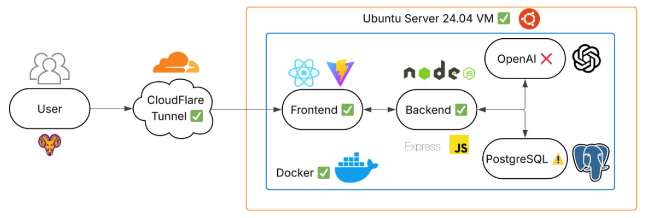

---
# CSC-402 Software Engineering Project

A full-stack web application for rate-my-course, a university course and professor rating platform. The project demonstrates modern software engineering practices through containerized microservices architecture.

---

## Architecture Overview

The system follows a containerized microservices pattern orchestrated with Docker Compose. All services communicate internally through a bridge network, with Nginx acting as the primary reverse proxy and load balancer at the public entry point.

  

### Service Topology

- **Frontend Service**: React-based single-page application compiled with Vite
- **Backend Service**: Node.js/Express REST API server
- **Database Service**: PostgreSQL relational database
- **Proxy Service**: Nginx reverse proxy and request router

---

## Frontend Architecture

### Technology Stack

- **React 19.1.1**: Core UI framework with hooks for state management
- **Vite 7.1.7**: Build tool and development server with hot module replacement
- **React Router DOM 7.9.3**: Client-side routing and navigation
- **Axios 1.13.1**: HTTP client for backend API communication
- **React Icons 5.5.0**: Scalable vector icon library
- **PapaParse 5.5.3**: CSV parsing utility

### Build Process

The frontend uses a multi-stage Docker build:
1. **Build Stage**: Node 22 Alpine container installs dependencies and executes Vite build process, generating optimized production assets in `/dist`
2. **Production Stage**: Nginx Alpine container serves static files from `/usr/share/nginx/html` with custom Nginx configuration for SPA routing

### Component Structure

**Layout Components**:
- `Layout.jsx` / `Layout.css`: Master page template with navigation framework
- `Sidebar.jsx` / `Sidebar.css`: Navigation drawer component
- `Subbar.jsx` / `Subbar.css`: Secondary navigation and filtering interface
- `Footer.jsx` / `Footer.css`: Application footer with links
- `ScrollToTop.jsx`: Utility component for scroll position management

**Feature Components**:
- `SearchBar.jsx` / `SearchBar.css`: Course and professor search interface
- `ReviewModal.jsx` / `ReviewModal.css`: Modal dialog for submitting reviews with complex form validation

### Page Routes

**Authentication Pages**:
- `Login.jsx`: User authentication with session management
- `Verify.jsx`: Email verification flow
- `VerifySuccess.jsx` / `VerifyFailed.jsx`: Verification status pages
- `ResetPassword.jsx`: Password recovery functionality
- `AccountSettings.jsx`: User account management

**Content Pages**:
- `Majors.jsx` / `MajorPage.jsx`: Major listing and major-specific course view
- `Ratings.jsx`: Course ratings and reviews display with filtering
- `Professors.jsx`: Professor directory and ratings
- `Posts.jsx`: Discussion/post listing interface
- `Menu.jsx`: Navigation menu page
- `About.jsx`: Application information page
- `Support.jsx`: User support and help resources
- `Page.jsx`: Generic content page handler

### API Integration

`api.js` provides a centralized Axios instance configured with:
- Base URL pointing to backend `/api` endpoint
- Default request/response interceptors
- Automatic header configuration

### Styling

Global styles defined in `index.css` establish design tokens and CSS variables. Component-scoped styling via individual CSS files enables modular design with minimal naming conflicts.

### Build Output

The Vite build process produces:
- Optimized JavaScript bundles with tree-shaking
- Minified CSS with vendor prefixing
- Hashed asset filenames for cache invalidation
- Source map generation for debugging

---

## Backend Architecture

### Technology Stack

- **Express 4.21.2**: Lightweight HTTP server framework
- **Node.js 18 Alpine**: Runtime environment
- **PostgreSQL Client (pg 8.16.3)**: Database driver with connection pooling
- **bcryptjs 3.0.3**: Password hashing and verification
- **jsonwebtoken 9.0.2**: JWT creation and validation
- **connect-pg-simple 10.0.0**: PostgreSQL session store
- **express-session 1.18.2**: Session management middleware
- **Nodemailer 7.0.10**: Email delivery for notifications and verification
- **CORS 2.8.5**: Cross-origin resource sharing configuration
- **Google Generative AI 0.24.1**: AI-powered course/professor suggestions
- **dotenv 16.3.1**: Environment variable management

### Server Initialization

`server.js` orchestrates the Express application lifecycle:

1. **Environment Configuration**: Loads environment variables from `.env` file
2. **Database Pool Setup**: Creates PostgreSQL connection pool with credentials from environment
3. **Session Store**: Configures PostgreSQL-backed session persistence with 24-hour TTL
4. **CORS Middleware**: Enforces origin whitelist (localhost for development, production domain for deployment)
5. **Request Parsing**: Enables JSON request body parsing
6. **Route Mounting**: Registers six primary route modules
7. **Health Checks**: Provides diagnostic endpoints at `/health` and `/data`
8. **Server Binding**: Listens on `0.0.0.0:8080` for container accessibility

### Route Modules

**Authentication** (`authRoutes.js`):
- User registration with email verification
- Login with session creation
- Logout with session termination
- Password reset flow via email
- Account deletion

**Courses** (`coursesRoutes.js`):
- List courses with pagination
- Retrieve course details with associated reviews
- Filter courses by major
- Search courses by name or code

**Reviews** (`reviewsRoutes.js`):
- Create course reviews with rating, difficulty, workload metrics
- Retrieve reviews by course or professor
- Update/delete user-authored reviews
- Flag reviews as helpful
- Pagination and sorting

**Majors** (`majorRoutes.js`):
- List all academic majors
- Get major details with course listings
- Course distribution within major

**Professors** (`profRoutes.js`):
- Professor directory with ratings
- Professor-specific review aggregation
- Professor assignment to courses

**AI Integration** (`aiRoutes.js`):
- Google Generative AI integration for course recommendations
- Natural language query processing
- Intelligent course suggestions based on user preferences and academic history

### Middleware Layer

**Authentication Middleware** (`auth.js`):
- Session validation for protected routes
- JWT token verification
- User context injection into request object

**Pagination Middleware** (`paginateMiddleware.js`):
- Standardized pagination parameter parsing (page, limit, offset)
- Database query offset calculation
- Consistent pagination response formatting

### Database Connectivity

The backend maintains a persistent connection pool to PostgreSQL:
- Pool size configured for concurrent request handling
- Connection timeout and retry logic
- Automatic connection recycling

### Session Management

Sessions persist in PostgreSQL via `connect-pg-simple` adapter:
- Stores session data in `session` table
- 24-hour cookie maximum age
- HTTPOnly flag prevents client-side script access
- Server-side session validation on each request

---

## Database Architecture

### PostgreSQL Design

The database (`rate_my_course`) serves as the single source of truth for all application data.

### Schema Design

Tables created in `01_create_create_tables.sql`:

**Core Entity Tables**:
- `users`: User accounts with authentication credentials, email, verification status
- `majors`: Academic major definitions and metadata
- `professors`: Faculty member directory with department affiliation
- `courses`: Course catalog with code, title, credit hours, major association
- `reviews`: User-submitted reviews linking courses/professors with ratings and commentary

**Session Table**:
- `session`: Express session store for user authentication state

### Data Population

`rate_my_course_data.sql` contains:
- Seed data for 50+ majors representing common academic disciplines
- Comprehensive course catalog across all majors
- Professor directory
- Sample reviews demonstrating rating distributions

### Initialization Process

Database initialization occurs automatically on container startup:
- `/docker-entrypoint-initdb.d` directory mounted in database container
- SQL scripts in this directory execute sequentially on first container run
- Idempotent schema creation prevents errors on container restart

### Persistent Storage

PostgreSQL data volume (`pgdata`) persists between container restarts, preserving data integrity across deployment cycles.

---

## Deployment Architecture

### Container Orchestration

`docker-compose.yml` defines the complete application stack with four services:

**Backend Service**:
- Builds from `./backend/Dockerfile`
- Port 8080 exposed internally only
- Environment variables passed from `.env`
- Depends on database service
- Restart policy: unless-stopped

**Frontend Service**:
- Builds from `./frontend/Dockerfile`
- Port 80 exposed internally only
- Depends on backend service
- Restart policy: unless-stopped

**Database Service**:
- Uses PostgreSQL 15 official image
- Volume mounted for data persistence
- SQL initialization scripts mounted
- Environment credentials from `.env`
- Restart policy: always

**Nginx Service**:
- Uses official Nginx image
- Mounts custom configuration from `./nginx/nginx.conf`
- Port 80 mapped to host (public entry point)
- Routes to frontend and backend services
- Depends on both frontend and backend services
- Restart policy: unless-stopped

### Network Configuration

Two networks defined:
- **internal**: Private network for service-to-service communication (backend, frontend, database)
- **public**: External network for client access (only Nginx)

This topology ensures:
- Database is never directly exposed to the internet
- Backend API is only accessible through Nginx
- Frontend assets served through Nginx
- All inter-service communication remains internal

### Environment Variables

`.env` file configures:
- `NODE_ENV`: Application environment (production/development)
- `BACKEND_PORT`: Backend service port
- `DB_HOST`, `DB_USER`, `DB_PASSWORD`, `DB_NAME`, `DB_PORT`: Database credentials
- `JWT_SECRET`: Token signing key for authentication
- `GEMINI_API_KEY`: Google AI integration credentials
- `FRONTEND_URL`: Frontend domain for redirects

### Nginx Configuration

`nginx/nginx.conf` implements reverse proxy logic:
